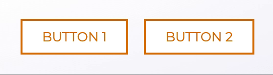

# React + TypeScript + Next.js + UnoCSS + shadcn/ui

Andrey's starter project.

Includes a parallax banner, navbar, mobile menu and an animated heads/tails coin flip with a reset button.

See live: https://starter-ts-next-uno-shad.vercel.app

Alternatively, see my [Vite + UnoCSS + shadcn/ui starter](https://github.com/andreysamode/starter-ts-vite-uno-shad).

## Getting started
```
git clone https://github.com/andreysamode/starter-ts-next-uno-shad .
npm i
npm run dev
```

## UnoCSS vs. Tailwind
Let's say we want to make a couple of simple buttons that fill with a color from left to right on hover.



Tailwind:
```js
<div className='[&_button]:bg-gradient-to-r [&_button]:bg-[length:210%] [&_button]:bg-right
[&_button]:from-amber-600 [&_button]:from-50% [&_button]:to-white [&_button]:to-50% 
  [&_button]:transition-300 [&_button]:transition-all [&_button]:border-2 
  [&_button]:border-solid [&_button]:border-amber-600 [&_button]:text-amber-600 
  [&_button]:px-5 [&_button]:py-2 [&_button]:mx-2 [&_button:hover]:bg-left 
[&_button:hover]:text-white'>
  <button>BUTTON 1</button>
  <button>BUTTON 2</button>
</div>
```

Tailwind, if repeating the code for each button:
```js
<div>
  <button className='bg-gradient-to-r bg-[length:210%] bg-right from-amber-600 from-50% 
  to-white to-50% transition-300 transition-all border-2 border-solid border-amber-600 
  text-amber-600 px-5 py-2 mx-2 hover:bg-left hover:text-white'>BUTTON 1</button>
  <button className='bg-gradient-to-r bg-[length:210%] bg-right from-amber-600 from-50% 
  to-white to-50% transition-300 transition-all border-2 border-solid border-amber-600 
  text-amber-600 px-5 py-2 mx-2 hover:bg-left hover:text-white'>BUTTON 2</button>
</div>
```

UnoCSS:
```js
<div className='[&_button]:(bg-(gradient-to-r [length:210%] right) from-(amber-600 50%) 
  to-(white 50%) transition-(300 all) b-(2 solid amber-600) text-amber-600 px-5 py-2
  hover:(bg-left text-white))'>
  <button>BUTTON 1</button>
  <button>BUTTON 2</button>
</div>
```

This also works with responsive screen sizes (use `lt-sm` for phone size).

UnoCSS animations: https://animate.zyob.top

## shadcn/ui
Components: https://ui.shadcn.com/docs/components/button

To add a new component:
```
npx shadcn-ui@latest add button
```

## Next.js particularities
UnoCSS doesn't work with Next.js out of the box. To overcome this, we use unocss-cli, which generates `src/app/uno-cli.css` and watches for file changes on dev.

package.json:
```
...
"scripts": {
    "dev": "concurrently 'next dev' 'npm run dev:css'",
    "build": "./build.sh",
    "start": "next start",
    "lint": "next lint",
    "dev:css": "unocss -c uno.config.ts -o src/app/uno-cli.css -w 'src/**/*.tsx'",
    "build:css": "unocss -c uno.config.ts -o src/app/uno-cli.css 'src/**/*.tsx'"
  },
...
```

While unocss-cli works on dev, Next.js ignores the variant groups transformer on build. To overcome this, we make a copy of `src` and run unocss-cli with the `--write-transformed` parameter, which breaks out the variant groups before build. We then copy back our original `src` with variant groups intact.

build.sh:
```bash
#!/bin/bash
if [ -d 'src-orig' ]; then
  echo 'ERROR: Last build did not clean up successfully. Please replace "src" with "src-orig"'
else
  cp -r src src-orig
  unocss -c uno.config.ts -o src/app/uno-cli.css 'src/**/*.tsx' --write-transformed
  next build
  rm -rf src
  mv src-orig src
  echo 'DONE!'
  echo 'IMPORTANT: Flip away and back from the currently opened tab if it has variant groups.'
fi
```

Next.js also doesn't honor CSS import order. This results in unexpected style overrides with UnoCSS and shadcn/ui. To preserve the order of imports, we import styles through src/app/globals.css:
```css
@import '@unocss/reset/tailwind.css';
@import '@/app/uno-cli.css';
...
```